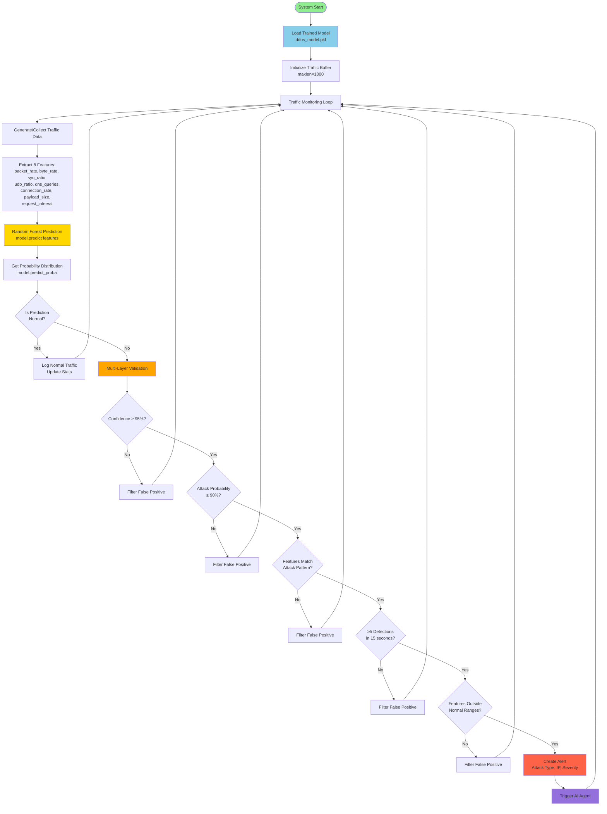
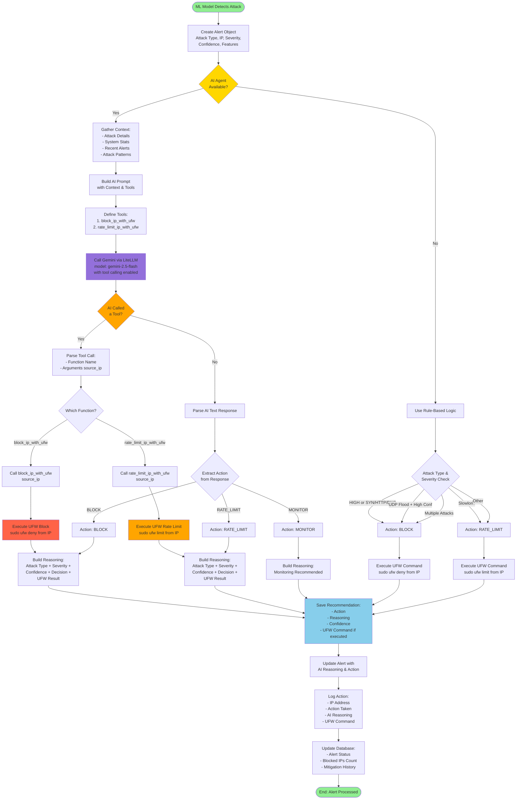
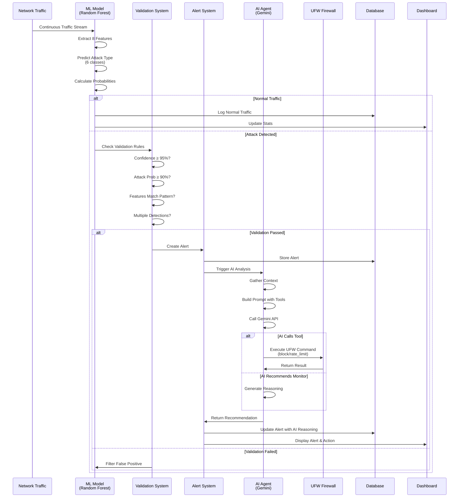

# ML Model and AI System Explanation

This document explains how the ML model and AI agent work in the DDoS Shield system, with detailed Mermaid diagrams.

## Table of Contents
1. [ML Model Architecture](#ml-model-architecture)
2. [ML Model Workflow Diagram](#ml-model-workflow-diagram)
3. [AI Agent Architecture](#ai-agent-architecture)
4. [AI Agent Workflow Diagram](#ai-agent-workflow-diagram)

---

## ML Model Architecture

### Overview
The ML model is a **Random Forest Classifier** that detects 5 types of DDoS attacks by analyzing 8 network traffic features in real-time.

### Key Components

#### 1. **Training Phase** (`train_model.py`)
- **Algorithm**: Random Forest Classifier (scikit-learn)
- **Parameters**:
  - `n_estimators=100`: 100 decision trees
  - `max_depth=10`: Maximum tree depth
  - `random_state=42`: Reproducible results
  - `n_jobs=-1`: Parallel processing

#### 2. **Features (8 Network Characteristics)**
The model analyzes these features from network traffic:

1. **packet_rate**: Packets per second
2. **byte_rate**: Bytes per second
3. **syn_ratio**: Ratio of SYN packets (TCP connection attempts)
4. **udp_ratio**: Ratio of UDP packets
5. **dns_queries**: DNS queries per second
6. **connection_rate**: New connections per second
7. **payload_size**: Average payload size in bytes
8. **request_interval**: Average time between requests (milliseconds)

#### 3. **Attack Classes (6 Total)**
- **Class 0**: Normal traffic (60% of training data)
- **Class 1**: SYN Flood (8% of training data)
- **Class 2**: HTTP Flood (8% of training data)
- **Class 3**: UDP Flood (8% of training data)
- **Class 4**: Slowloris (8% of training data)
- **Class 5**: DNS Amplification (8% of training data)

#### 4. **Training Data Generation**
- **Total Samples**: 10,000 synthetic samples
- **Distribution**: 60% normal, 8% per attack type
- **Method**: Gaussian distribution with attack-specific patterns
- **Example Patterns**:
  - **SYN Flood**: High SYN ratio (0.9), high connection rate (50/sec)
  - **HTTP Flood**: High packet rate (800/sec), large payloads (400 bytes)
  - **UDP Flood**: High UDP ratio (0.8), high packet rate (1200/sec)
  - **Slowloris**: Long request intervals (5000ms), many connections (100/sec)
  - **DNS Amplification**: High DNS queries (50/sec), large responses (800 bytes)

#### 5. **Model Performance**
- **Accuracy**: ~95% on synthetic test data
- **Validation**: 80/20 train-test split
- **Output**: Prediction class + probability distribution

### Detection Process

#### Real-Time Detection Flow
1. **Traffic Monitoring**: Continuous network traffic simulation/collection
2. **Feature Extraction**: Calculate 8 features from traffic window
3. **Model Prediction**: Random Forest predicts attack type
4. **Confidence Check**: Verify prediction confidence ≥ 95%
5. **Validation**: Multi-layer validation to reduce false positives:
   - Attack probability ≥ 90%
   - Features match expected attack patterns
   - Multiple detections in 15-second window (≥5 detections)
   - Features outside normal traffic ranges
6. **Alert Creation**: If validated, create alert and trigger AI agent

#### False Positive Prevention
The system uses multiple validation layers:
- **Confidence Threshold**: 95% minimum confidence
- **Attack Probability**: 90% minimum for attack classes
- **Feature Validation**: Features must match expected attack patterns
- **Time Window**: Require 5+ detections within 15 seconds
- **Normal Range Check**: Filter out traffic within normal ranges

---

## ML Model Workflow Diagram



---

## AI Agent Architecture

### Overview
The AI agent uses **Google Gemini** (via LiteLLM) to intelligently analyze DDoS attacks and automatically execute firewall mitigation actions using **tool calling**.

### Key Components

#### 1. **AI Technology Stack**
- **LLM**: Google Gemini 2.5 Flash (via LiteLLM)
- **Interface**: LiteLLM (unified LLM interface)
- **Tool Calling**: Function calling for UFW firewall commands
- **Fallback**: Rule-based logic if AI unavailable

#### 2. **Input Context**
The AI agent receives comprehensive context:

**Attack Details**:
- Attack type (SYN_Flood, HTTP_Flood, etc.)
- Source IP address
- Severity (HIGH, MEDIUM, LOW)
- Confidence score (0-1)
- Feature values (packet_rate, byte_rate, etc.)

**System Context**:
- Total requests processed
- Threats detected count
- Blocked IPs count
- Recent alerts (pattern analysis)

**Historical Data**:
- Recent attack patterns
- Attack frequency trends
- System load metrics

#### 3. **Decision Making Process**
The AI agent analyzes:
1. **Attack Severity**: HIGH attacks → immediate blocking
2. **Attack Type**: Different types require different strategies
3. **System Load**: Current capacity and resource usage
4. **Attack Patterns**: Recent history and trends
5. **False Positive Risk**: Confidence and feature validation

#### 4. **Available Actions**
The AI can execute three types of actions:

1. **BLOCK** (`block_ip_with_ufw`):
   - Command: `sudo ufw deny from <ip>`
   - Use for: High-severity attacks (SYN Flood, HTTP Flood, DNS Amplification)
   - Result: IP immediately blocked

2. **RATE_LIMIT** (`rate_limit_ip_with_ufw`):
   - Command: `sudo ufw limit from <ip>`
   - Use for: Moderate threats (UDP Flood, Slowloris)
   - Result: IP traffic throttled

3. **MONITOR**:
   - No action taken
   - Use for: Low-severity or uncertain threats
   - Result: Continue monitoring

#### 5. **Tool Calling Mechanism**
The AI uses **function calling** (tool calling) to execute UFW commands:

1. **Tool Definition**: Two tools defined in prompt:
   - `block_ip_with_ufw(source_ip)`
   - `rate_limit_ip_with_ufw(source_ip)`

2. **AI Decision**: Gemini analyzes context and decides which tool to call

3. **Tool Execution**: System executes the tool call:
   - Parses function arguments
   - Calls UFW tool function
   - Executes/simulates UFW command
   - Returns result

4. **Response Processing**: System processes tool result and logs action

#### 6. **Fallback System**
If AI is unavailable:
- **Rule-Based Logic**: Predefined rules based on attack type and severity
- **No Service Interruption**: System continues functioning
- **Logging**: Indicates which method was used

### AI Decision Examples

#### Example 1: High-Severity SYN Flood
```
Input: SYN_Flood, Severity: HIGH, Confidence: 95%
AI Decision: BLOCK
Tool Called: block_ip_with_ufw(10.0.1.23)
Command: sudo ufw deny from 10.0.1.23
Reasoning: "High confidence SYN Flood attack. System under moderate load. 
           Immediate blocking recommended to prevent service degradation."
```

#### Example 2: Moderate UDP Flood
```
Input: UDP_Flood, Severity: MEDIUM, Confidence: 92%
AI Decision: RATE_LIMIT
Tool Called: rate_limit_ip_with_ufw(192.168.5.10)
Command: sudo ufw limit from 192.168.5.10
Reasoning: "Moderate UDP Flood detected. Rate limiting to throttle attack 
           while preserving legitimate connections."
```

#### Example 3: Low-Confidence Detection
```
Input: HTTP_Flood, Severity: LOW, Confidence: 75%
AI Decision: MONITOR
Tool Called: None
Reasoning: "Low confidence detection. Monitoring recommended - threat level 
           not sufficient for immediate action. Continue observing patterns."
```

---

## AI Agent Workflow Diagram



---

## Integration Flow: ML → AI

### Complete System Flow



---

## Key Differences: ML vs AI

| Aspect | ML Model | AI Agent |
|--------|----------|----------|
| **Purpose** | Detect attacks | Decide mitigation |
| **Input** | 8 network features | Attack context + system stats |
| **Output** | Attack type + probability | Action (BLOCK/RATE_LIMIT/MONITOR) |
| **Technology** | Random Forest (scikit-learn) | Gemini LLM (via LiteLLM) |
| **Execution** | Real-time classification | Contextual decision-making |
| **Actions** | Classification only | Executes firewall commands |
| **Learning** | Pre-trained on synthetic data | Uses pre-trained language model |

---

## Summary

### ML Model
- **What it does**: Classifies network traffic as normal or one of 5 attack types
- **How it works**: Random Forest analyzes 8 features in real-time
- **Output**: Attack type prediction with confidence scores
- **Validation**: Multi-layer validation prevents false positives

### AI Agent
- **What it does**: Analyzes detected attacks and executes mitigation
- **How it works**: Gemini LLM analyzes context and calls UFW tools
- **Output**: Mitigation action (BLOCK/RATE_LIMIT/MONITOR) with reasoning
- **Fallback**: Rule-based logic if AI unavailable

Together, they form a complete **detect → analyze → mitigate** pipeline for DDoS protection.

